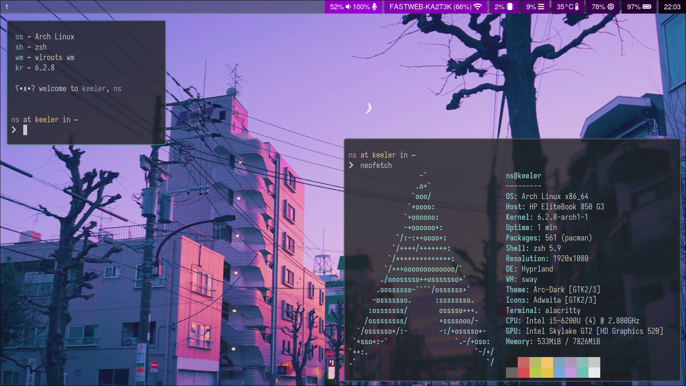

# hyprdotfiles

Like <a href="https://github.com/notsnowden/dotfiles">dotfiles</a>, but for Hyprland
  
<b>What's in here?</b>
 
<ul>
    <li>hyprland config</li>
    <li>waybar -> status bar</li>
    <li>wofi -> apps launcher</li>
    <li>terminal emulator -> alacritty</li>
    <li>text editor -> nvim (not much in it)</li>
    <li>.zshrc -> my beautiful aliases</li>
    <li>.zprofile -> starts Hyprland after login from tty</li>
    <li>some cool apps I need for my workflow (give them a look if you want to use this dots)</li>
    <li>some wallpapers (yanked from super kind users in unixp*rn)</li>
</ul>

<h2>Example</h2>

